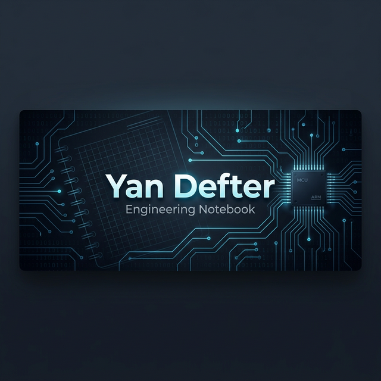

<div align="center">

# Yan Defter (Side Notebook)
### Personal Engineering Notebook


</div>

---

## 📖 Hakkında (About)
**Yan Defter**, mühendislik kariyerim boyunca edindiğim notları, denemeleri, araştırmaları ve mini projeleri topladığım kişisel "Side Notebook"umdur. Burası, akademik ciddiyetten ziyade, "öğrenirken not alma" ve "dene-yanıl" kültürünün bir ürünüdür.

Bu depo, **Gömülü Sistemler, FPGA, ASIC Tasarımı, RF** ve **Yüksek Hızlı Dijital Tasarım** gibi niş alanlardaki çalışmalarımı içerir.

## 🗂️ İçerik (Contents)

| Konu | Açıklama |
| :--- | :--- |
| **⚡ ASIC Tasarımı** | [ASIC_Tasarımı](ASIC_Tasarımı) - RTL'den GDSII'a giden yolda notlar ve denemeler. |
| **🛠️ VHDL & FPGA** | [VHDL](VHDL), [fpga](fpga) - Donanım tanımlama dilleri ve FPGA projeleri. |
| **📡 RF & SDR** | [RF](RF), [SDR](SDR) - Radyo frekansı tasarımı ve Yazılım Tabanlı Radyo çalışmaları. |
| **💻 Gömülü Linux** | [Embedded Linux + Device Driver Development](Embedded%20Linux%20%2B%20Device%20Driver%20Development) - Kernel modülleri ve sürücü geliştirme. |
| **🚀 RISC-V** | [RISC‑V_Core _Design](RISC‑V_Core%20_Design) - Açık kaynaklı işlemci mimarisi üzerine çalışmalar. |
| **📐 PCB & Signal Integrity** | [High-Speed_Digital_Design](High-Speed_Digital_Design) - Yüksek hızlı devre tasarımı prensipleri. |
| **🔒 Donanım Güvenliği** | [Donanım_Güvenliği](Donanım_Güvenliği) - Hardware Trojan, Side-Channel Analysis vb. |
| **🧮 Hesaplama & PLC** | [MATLAB](MATLAB), [plc](plc) - Bilimsel hesaplama ve otomasyon notları. |

---

## 🛠️ Teknolojiler ve Araçlar (Tech Stack & Tools)

Bu laboratuvarda, farklı mühendislik disiplinlerine yönelik çeşitli diller ve araçlar kullanılmaktadır:

*   **Donanım Tanımlama Dilleri (HDL):** VHDL, Verilog, SystemVerilog
*   **Gömülü Sistemler:** C, C++, Linux Kernel API, Device Trees
*   **Sinyal İşleme ve Veri Analizi:** MATLAB, Python (NumPy, SciPy)
*   **Ağa ve İletişim:** RF / SDR araç zincirleri, Socket programlama
*   **Sentez ve Simülasyon:** ModelSim, Xilinx Vivado, Intel Quartus, GHDL

---

## 📂 Klasör Yapısı (Directory Structure)

Depo, modüler bir laboratuvar mantığıyla organize edilmiştir. Her klasör kendi dünyasını temsil eder:

```text
yan-defter/
├── ASIC_Tasarımı/        # RTL, Sentez ve Fiziksel Tasarım notları
├── VHDL/                 # VHDL ile dijital modül tasarımları ve testbenchler
├── Embedded Linux.../    # Kernel modülleri ve aygıt sürücüleri (Device Drivers)
├── MATLAB/               # DSP ve matematiksel algoritmalar
├── High-Speed_Dig.../    # PCB ve Sinyal Bütünlüğü (SI/PI) notları
├── RISC‑V_Core_Design/   # Açık kaynak mimari çalışmaları
└── ...
```

---

## 🗺️ Yol Haritası (Roadmap)
Bu defter sürekli güncellenen canlı bir organizmadır. Gelecekte eklenmesi planlanan konular:
- [ ] Gelişmiş Linux SPI/I2C Sensör Sürücüleri
- [ ] RISC-V için basit bir 5-stage pipeline işlemci tasarımı
- [ ] MATLAB ile Gelişmiş QAM/OFDM modülasyonu simülasyonları
- [ ] Donanım Güvenliği: Side-channel attacks notları

---

## 🚀 Başlarken (Getting Started)
Her klasör kendi içinde bağımsız projeler veya notlar barındırır. İlgilendiğiniz başlığın içine girerek oradaki `README.md` dosyasını okuyabilirsiniz.

Örneğin VHDL notları için:
```bash
cd VHDL
# İçeriği inceleyin
```

## 🤝 Katkıda Bulunma (Contributing)
Bu kişisel bir not defteri olsa da, hataları düzeltmek veya eklemeler yapmak isterseniz Pull Request göndermekten çekinmeyin! Lütfen [CONTRIBUTING.md](CONTRIBUTING.md) dosyasını inceleyin.

## ⚖️ Lisans (License)
Bu proje MIT Lisansı altında lisanslanmıştır. Detaylar için [LICENSE](LICENSE) dosyasına bakabilirsiniz.

---
<div align="center">
  <sub>Created with ❤️ by Bahattin Yunus</sub>
</div>

